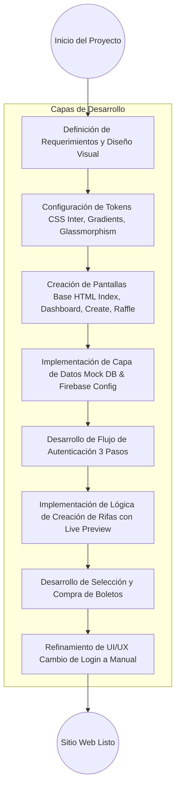
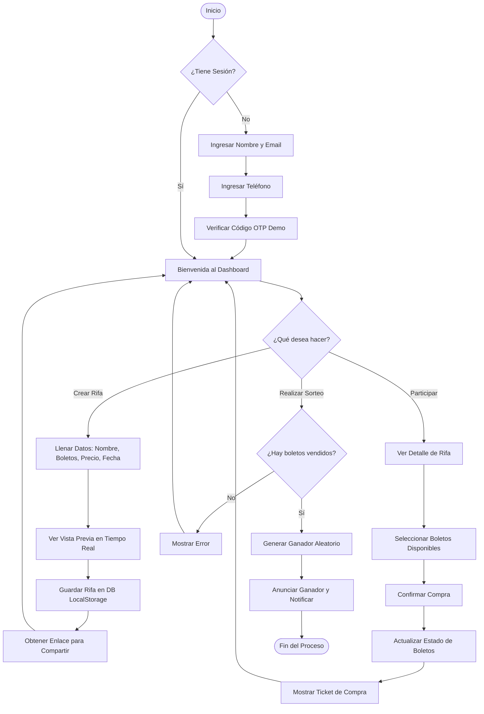

# Proceso de Elaboración de RifaMax

Este documento detalla el proceso seguido para el desarrollo del sitio web y el flujo lógico de la aplicación (BPMN).

## 1. Proceso de Desarrollo (AI & Usuario)

Este diagrama representa los pasos técnicos tomados para construir la plataforma desde cero.

## 2. Proceso de Negocio (Flujo de la Aplicación)

Este diagrama sigue el estándar BPMN para mostrar cómo interactúa un usuario con el sistema.

## Resumen de Tecnologías Utilizadas
- **Core**: HTML5, Vanilla JavaScript.
- **Styling**: CSS Moderno (Variables CSS, Flexbox, Grid).
- **Persistencia**: LocalStorage (Simulando Firebase Firestore en modo Demo).
- **Iconografía**: Emojis y SF Symbols style.
